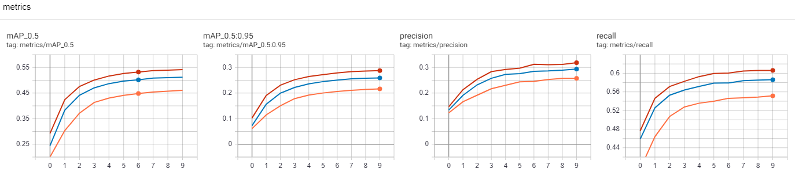
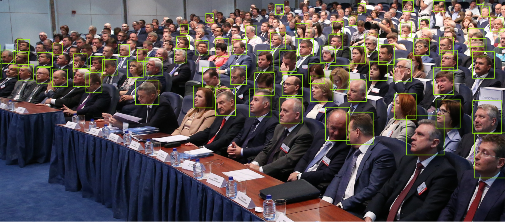
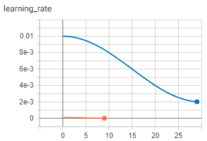
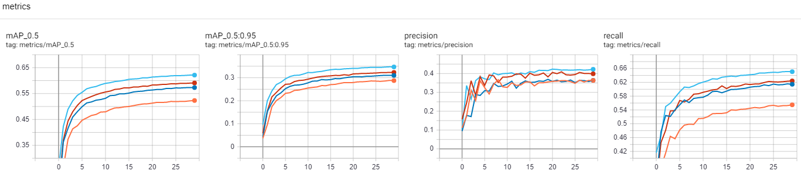

# Yolo_v4 人群偵測 ( crowdhuman detection )

### 目的
##### 人群人體偵測有著相當廣泛的應用需求，比如人潮的計數、監控系統、鏡頭對焦、還有最常使用到的人臉辨識，都會需要先把人或是人臉給定位出來，再來做後續的辨識或是計數等等。但是人群中的人影常常彼此交錯著，而且距離遠近不同造成大小差異，對模型的學習訓練而言著實是個巨大的挑戰。    
##### Yolo_v4 在物件偵測方面表現得非常出色，唯獨小物件還是表現不佳，畢竟小物件所佔的像素本來就過少所以導致資訊與特徵不足，所以相較起來會偵測地相當吃力，這篇就來試試拿Yolo_v4來挑戰一下看看人群偵測的效果如何，順便試試看稍微變動模型看看是否有所改善小物件的效果。  

### 資料集(dataset)
##### 這邊採用的是曠視公開的人群資料集(crowdhuman)，不得不說，這份資料集實在是驚人，裡面有些圖片甚至一張照片就有超過百人以上，光是標記label 我想都會是一個難題啊…  
##### crowdhuman 總共有15000圖片，內含共計 339565 個人，等於平均每張照片都有22個人，很適合用來做為人體或是人臉的訓練圖片集。    
  
##### 資料集提供的邊界框 label 是定義在 .odgt 檔案格式內，但其實裡頭的定義都是字典 dict 格式，所以可以直接用 json 套件去解析即可。  
##### 不過有幾點需要注意的是:
* .odgt 檔案裡面沒有記載圖片尺寸，所以還是得從圖片檔案裡面抓取，有了圖片的長與寬才能把 label 做正規化並轉出成 Yolov4 可接受的格式
* .odgt 檔案每一行代表一張圖片，”id” 為圖片檔名，邊界框則有三種: fbox、vbox、hbox。其中 fbox 表示全身(即使被遮住或在圖片外的也算)；vbox 則表示只在圖片中看的到的身體部分；hbox 則是表示人頭的邊界框。其中 vbox 和 hbox 是我這次需要用到的，要注意的是hbox可能會標記在圖片外頭，做正規化後可能會小於0或是大於1，這些超出範圍的 label 都要拿掉不要放入訓練與測試資料集中。
* .odgt 檔案裡面邊界框的定義是 x0, y0, w, h，其中 (x0, y0)是左上角的座標，不是邊界框的中心點座標，輸出時做個簡單轉換與正規化成Yolo接受的格式即可。

### 遷移式訓練 ( Train, transfer learning)
##### 首先先快速地用遷移式學習訓練來看一下不同尺寸的模型在人群資料集的訓練情況，分別測試了 Large、Medium、Small 大中小三個模型。第一個測試呢，先試著同時做 全身 和 人頭 的偵測，也就是說 data.yaml 裡面定義的是 nc=2, names=[‘head’, ‘body’]，看看同時存在大物件和小物件的效果。
* Learning Rate:  

* mAP / Precision / Recall

* Train Loss

* Valid Loss

##### 先以訓練的曲線來說，L模型的效果當然是比較好。挑一張比較容易看出差異的圖片來看一下效果:  
* Small model prediction (class: body and head)

* Medium model prediction (class: body and head)

* Large model prediction (class: body and head)
  

##### 很明顯地，大模型(L)標記的邊界框比小模型(S)還要更貼近人體，而且數目更多，尤其遠方較小的人頭也標記的較多，但似乎還是有很多也是沒有偵測到並標記...  
##### 那如果我們只關心小物件(人頭)的訓練，那結果又會是如何?  

* mAP / Precision / Recall

* Train Loss

* Valid Loss

##### 如果以 mAP 和 Precision 來看，訓練中有沒有包含大物件(全身)似乎沒有差異，Recall 高了一些應該是較易偵測的大物件(全身)影響，GIoU差異似乎也些微而已，obj loss 高了些似乎也是因為多了一種物件所以相對 loss 較大的緣故。所以訓練上似乎差異不大，但是實際測試如何呢?  
* Large model prediction ( class: head only )
  
##### 同樣以這張圖來看，只有單單訓練小物件(人頭)的效果更好。個人認為可能最主要的因素是因為 autoanchor 在一開始預先計算 anchor 尺寸時，能夠算出適合小物件(人頭)的尺寸，而且少掉了大物件(全身)的影響，所以後續訓練和預測上能夠更佳地偵測到更多的小物件。不過更遠處還是有小部分更小的人頭並沒有被偵測到，這就有待後續的改善了。

### 從零開始訓練 (Train, from-scratch)
##### 由於從零開始訓練需要比較久的運算時間，還有後續的模型修改需要更多記憶體，所以下面都以小模型(S)去做測試，訓練圖片尺寸亦從 640x640 降低為 512x512，另外由於僅僅訓練小物件(人頭)會有較佳效果，所以這邊會全部改為僅僅訓練小物件(人頭)為主。 
##### 首先先看一下經過 30 epochs 的訓練後，從零開始訓練的小模型(S)和前一段提到經過10 epochs的遷移式訓練的最佳結果大模型(L)比較:  
* Learning Rate:  

* mAP / Precision / Recall
  

##### 很神奇的是，從零開始訓練的小模型(S)結果居然逐漸接近遷移式訓練的大模型(L)結果，也許是因為遷移式訓練當初的coco資料集都是以中大型物件為主，所以訓練出來的結果遷移到小物件(人頭)做微調也有其極限；反之從零開始訓練可以讓模型去學習訓練全部都是小物件的資料集，對小物件的偵測效果因此有提升。如果小模型從零開始都可以得到不錯的效果，那換成大模型從零開始做小物件訓練想必應該可以得到更佳的結果。 
##### 除了直接把小模型替換成大模型以外，是否還有其他方法可以讓模型訓練學習去專門偵測小物件嗎? Yolov4 的 backbone 總共做了 stride =32 的下採樣，其中 stride=8、16、32的結果會往後送到 FPN 結構中，stride 越多表示特徵圖更小，但是內含的物件尺寸反而相對更大。也就是說backbone 往後送的資訊其實是比較偏向於大物件，而小物件的特徵在經過卷積(convolution)與stride的過程會逐漸整併而所剩無幾。所以如果把往後送的shortcut捷徑移向更前的話，勢必可以有更多的小物件特徵保留住而送到後方FPN中。  

##### 這是原來的 Yolov4 使用的 DarkNet53 架構: backbone 與 FPN 之間的 shortcut 連接處為( stride = 8、16、32)。模型參數總量為: 9116520。
  
##### 要把 shortcut 移到 stride=4 的位置來增加預測小物件的模型修改大概有三種簡單的作法:  
### model-1:  
##### 直接把原來連接到 stride=8 的 shortcut 改連到 stride=4 的位置，等於 backbone 與 FPN 之間的 shortcut 連接處變為( stride = 4、16、32)。由於尺寸變大，所以後面相關牽扯到的，上採樣要從2倍變成4倍，下採樣一樣要改成4倍(等於要再多做一個stride=2的卷積)。這個方式的缺點就是少了從 stride=8 往後送的特徵資訊。模型參數總量為: 9260130，變化不大。
  
### model-2:  
##### 原本的backbone總共做了 stride=32 才送到後面的FPN部分，這邊就把 backbone 的最後一次stride=2的 Conv 以及 BottleneckCSP 拿掉，等於整個 backbone 最後的輸出只剩下 stride=16，重新修改往後送的 shortcut，可以使得backbone 與 FPN 之間的 shortcut 連接處變為( stride = 4、8、16)。模型參數總量為: 6535530，減少了許多。  
  
### model-3:  
##### 最偷懶的方式就是把最前頭的 stride=2 拿掉，這樣就可以使得backbone 與 FPN 之間的 shortcut 連接處直接變為( stride = 4、8、16)。模型參數總量為: 9116520，沒有變化。但是因為圖片在一開始少了 stride=2 的減量，整體訓練需要用到的記憶體會大幅暴增。    
  

##### 訓練的比較結果如下:
* Learning Rate:  

* mAP / Precision / Recall

* Train Loss

* Valid Loss
  

##### 測試圖片如下:
* Large, transfer learning
  
* Small, from scratch
  
* Small, from scratch, model-1
  
* Small, from scratch, model-2
  
* Small, from scratch, model-3
  

##### 比較起來，model-2 和 model-3 的效果最佳，不過 model-3 的記憶體暴增太多，訓練上太吃運算資源，效果可能還不如直接更換為大模型做從零開始的訓練。所以如果訓練與測試的圖片集都是小物件的話，可以考慮把最後一級的stride拿掉，這樣可以讓模型專心於小物件的偵測。  
##### 另外圖片清晰度也是很重要的，比如如果光圈開得過大造成散景效果而有照片前面清楚後面模糊的情況，則Yolo在偵測上還是會有其極限。  
  

### 結論
##### 這篇簡單的介紹了使用 Yolov4 做人群中的全身與人頭的偵測，的確 Yolo 在小物件的效果有其限制，但是可以透過更換模型大小或是簡易修改內部連接方式可以稍微增加一些效果，當然如果可以更換大架構那說不定效果更佳，如果同時存在大物件或極小物件時那可能還得要因地制宜做修改才能達到最佳效果。  

### 參考資料
* Yolov4: https://github.com/WongKinYiu/PyTorch_YOLOv4
* Yolov5: https://github.com/ultralytics/yolov5
* Crowdhuman: https://www.crowdhuman.org/
